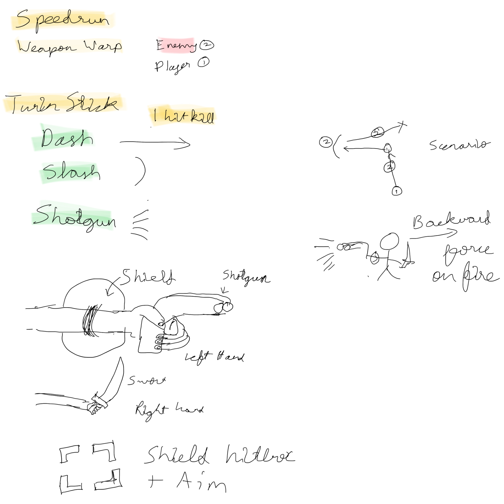

# Blade and Blast

Submission for [Pirate Software - Game Jam 16 (2025)](https://itch.io/jam/pirate16) made in 2 weeks.

[Blade and Blast - Play on Itch.io](https://t3snake.itch.io/blade-and-blast)

## Theme

`Power`

## Engine

Godot 4.3 in Compatibility mode (Now migrated to 4.4)

Web Build Hosted

## Assets Used (CC0)

- [Tiny Swords by Pixel Frog](https://pixelfrog-assets.itch.io/tiny-swords)
- [Platformer Bundle by Brackey](https://brackeysgames.itch.io/brackeys-platformer-bundle)
- [Font by Mathew Carter](https://practicaltypography.com/charter.html)

## Idea

